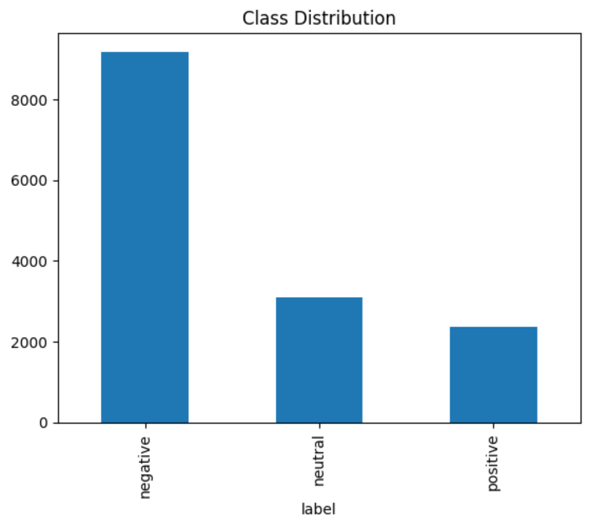
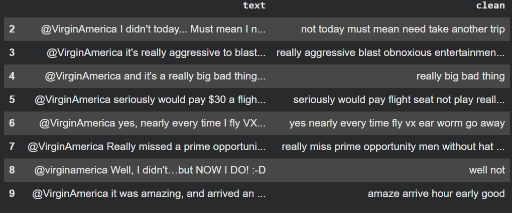
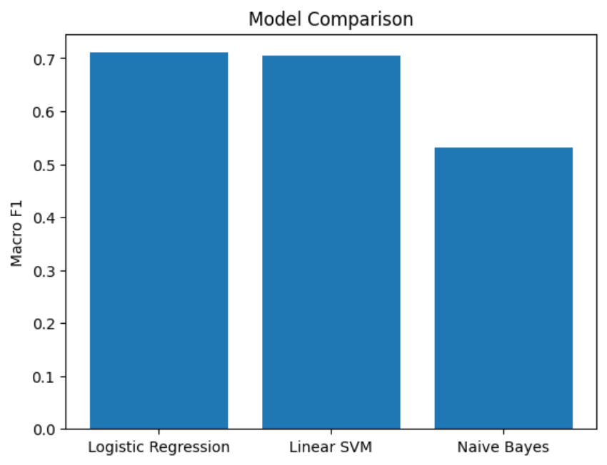
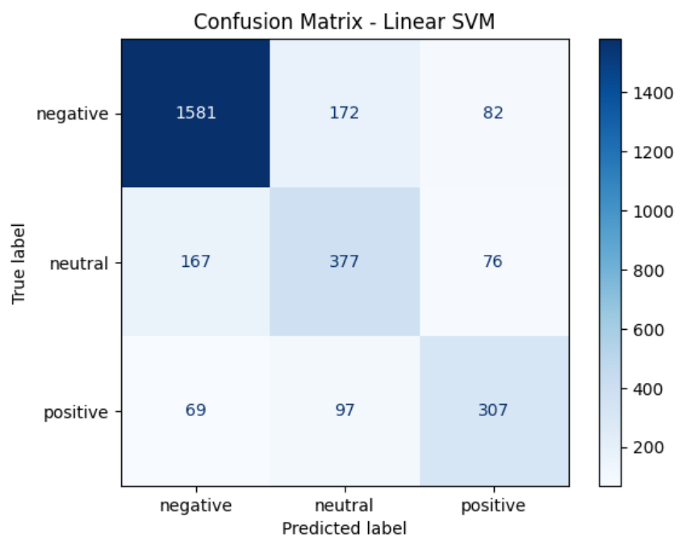

# NLP Sentiment Classifier: Twitter US Airline Sentiment

A multi-class text classification project that predicts whether an airline tweet is **positive**, **negative** or **neutral**.
Built with Python, NLTK and Scikit-Learn as part of an Artificial Intelligence internship task (Task 2).

**Author:** Muhammad Moeez Manzoor

## Dataset
[Twitter US Airline Sentiment](https://www.kaggle.com/datasets/crowdflower/twitter-airline-sentiment) (Crowdflower / Figure Eight, Kaggle):
14,640 tweets in 3 classes. The data is imbalanced (about 63% negative, 21% neutral, 16% positive), so the models are evaluated with **macro F1-score** instead of accuracy alone.

## Pipeline
1. **Cleaning:** lowercase, remove URLs, @mentions, numbers, punctuation and emojis
2. **Stop-word removal** (NLTK), keeping negation words such as "not", "no" and "never"
3. **Lemmatization** (WordNetLemmatizer)
4. **TF-IDF** features (5,000 terms)
5. **Stratified 80/20 train/test split** (11,712 train / 2,928 test tweets)
6. **Models compared:** Logistic Regression, Linear SVM, Multinomial Naive Bayes
7. **Evaluation:** precision, recall, F1-score and confusion matrix

Example of preprocessing (tweet text and cleaned text):

## Results
| Model | Macro F1 |
|---|---|
| **Logistic Regression** | **0.7105** |
| Linear SVM | 0.7053 |
| Multinomial Naive Bayes | 0.5313 |

Best model: **Logistic Regression** with macro F1 = **0.7105**, accuracy = 0.7606 and weighted F1 = 0.7684.

Confusion matrix of the Linear SVM model (second-best model):

## Observations
- The negative class is predicted best (F1 = 0.8463) because it is the largest class.
- The neutral class is the hardest (F1 = 0.6066): neutral tweets contain few sentiment words, so most errors involve this class.
- Negation words were kept during stop-word removal so that phrases like "not good" keep their meaning.
- Naive Bayes performed clearly worse than the other two models on this imbalanced data.

## Files
| File | Description |
|---|---|
| `*.ipynb` | Google Colab notebook with the full code |
| `sentiment_model.joblib` | Saved TF-IDF vectorizer and trained classifier |
| `images/` | Charts and screenshots used in this README |
| `requirements.txt` | Python libraries |

## How to run
1. Download `Tweets.csv` from the Kaggle dataset linked above
2. Open the notebook in Google Colab and upload `Tweets.csv`
3. Run all cells

## Tech stack
Python, Pandas, NLTK, Scikit-Learn, Matplotlib, Joblib
